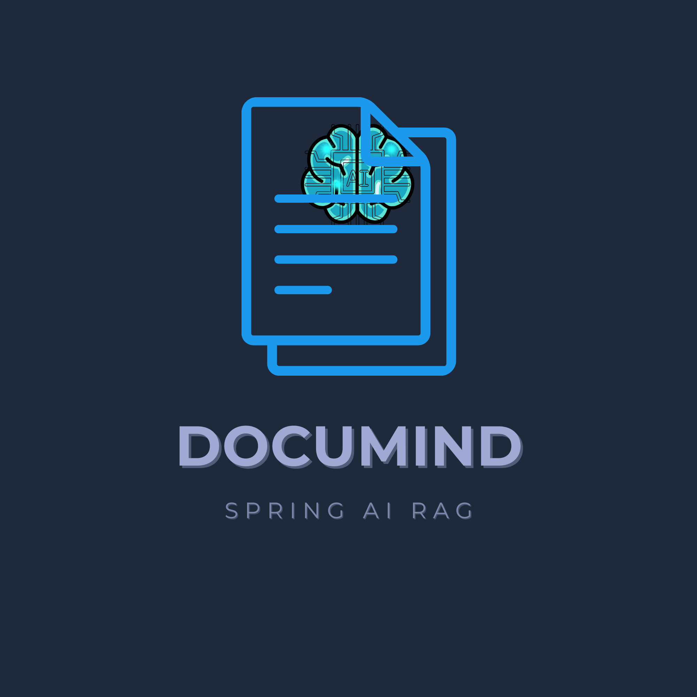

# Spring AI RAG 文档问答系统

<div align="center">

<!-- 项目 Logo -->


<!-- 动态标题效果 -->
<picture>
  <source media="(prefers-color-scheme: dark)" srcset="https://readme-typing-svg.demolab.com?font=Fira+Code&size=32&duration=2000&pause=1000&color=6DB33F&center=true&vCenter=true&width=600&lines=📚🤖+Spring+AI+RAG+文档问答系统">
  
</picture>

<!-- 徽章行1：项目统计 -->
<br>
[](https://github.com/Robbin-zjc/-spring-ai-RAG-ollama-documind/stargazers)
[](https://github.com/Robbin-zjc/-spring-ai-RAG-ollama-documind/network)
[](https://github.com/Robbin-zjc/-spring-ai-RAG-ollama-documind/issues)
[](LICENSE)

<!-- 徽章行2：技术栈 -->
<br><br>


<!-- 徽章行3：特性 -->
<br>


<!-- 导航链接 -->
<br><br>
<p>
  <a href="#-功能特性"><b>功能特性</b></a> •
  <a href="#-快速开始"><b>快速开始</b></a> •
  <a href="#-api-使用"><b>API 文档</b></a> •
  <a href="#️-配置说明"><b>配置说明</b></a>
</p>

</div>

---

**基于 Spring AI + Ollama + PGVector 的本地部署 RAG 系统**

## 🎯 功能特性

- ✅ **PDF 文档上传** - 支持大型 PDF 文件的解析和向量化
- ✅ **智能检索** - 基于语义的文档片段检索
- ✅ **混合搜索** - 主检索 + 多轮补充检索，提高召回率
- ✅ **动态优化** - 根据问题类型自动调整检索参数
- ✅ **本地部署** - 完全本地运行，数据隐私安全
- ✅ **多文档管理** - 支持多个文档的统一问答

## 🛠️ 技术栈

| 技术 | 版本 | 用途 |
|------|------|------|
| Spring Boot | 3.4.1 | 后端框架 |
| Spring AI | 1.0.0-M5 | RAG 框架 |
| Ollama | Latest | 本地 LLM 服务 |
| Llama 3.2 | Latest | 大语言模型 |
| PGVector | 0.7.0 | 向量数据库 |
| PostgreSQL | 16 | 关系数据库 |
| Apache Tika | - | PDF 解析 |

## 📦 系统架构

┌─────────────────────────────────────────────────┐
│ 用户请求 │
└───────────────────┬─────────────────────────────┘
│
▼
┌─────────────────────────────────────────────────┐
│ DocumentController (API层) │
│ - POST /api/upload 上传PDF │
│ - GET /api/documents 查看文档列表 │
│ - POST /api/query 智能问答 │
└───────────────────┬─────────────────────────────┘
│
▼
┌─────────────────────────────────────────────────┐
│ RAGService (业务逻辑层) │
│ - hybridSearch() 混合检索 │
│ - buildPrompt() 构建Prompt │
│ - 问题类型识别 + 动态参数调整 │
└─────┬─────────────────────────┬─────────────────┘
│ │
▼ ▼
┌─────────────┐ ┌──────────────────┐
│ VectorStore │ │ ChatClient │
│ (PGVector) │ │ (Ollama LLM) │
│ 向量检索 │ │ 生成答案 │
└─────────────┘ └──────────────────┘

text

## 🚀 快速开始

### 📋 前置要求

- ☕ Java 21+
- 🐳 Docker Desktop
- 📦 Maven 3.8+
- 💾 8GB+ 内存（用于运行 Ollama）

### ⚡ 一键启动（推荐）

#### Windows 用户
```cmd
# 1. 克隆项目
git clone https://github.com/your-username/spring-ai-rag-ollama.git
cd spring-ai-rag-ollama

# 2. 双击运行
start.bat
Mac/Linux 用户
bash
# 1. 克隆项目
git clone https://github.com/your-username/spring-ai-rag-ollama.git
cd spring-ai-rag-ollama

# 2. 一键启动
./start.sh
启动脚本会自动：

✅ 检查 Docker 状态

✅ 启动 PGVector 数据库

✅ 检查 Ollama 服务

✅ 启动 Spring Boot 应用

🤖 首次使用需要安装 Ollama
1. 下载安装 Ollama

Windows/Mac: https://ollama.ai/download

Linux: curl -fsSL https://ollama.ai/install.sh | sh

2. 拉取所需模型

bash
# 拉取 LLM 模型（约 2GB）
ollama pull llama3.2

# 拉取嵌入模型（约 270MB）
ollama pull nomic-embed-text

# 验证安装
ollama list
✅ 验证运行
访问 http://localhost:8080，或执行：

bash
# 查看文档列表（初始为空）
curl http://localhost:8080/api/documents
📖 API 使用
1️⃣ 上传文档
bash
curl -X POST http://localhost:8080/api/upload \
  -F "file=@/path/to/document.pdf"
响应示例：

text
文件上传并导入成功: 1770468280000_document.pdf
2️⃣ 查看文档列表
bash
curl http://localhost:8080/api/documents
响应示例：

json
[
  {
    "id": 1,
    "filename": "document.pdf",
    "fullPath": "1770468280000_document.pdf",
    "chunkCount": 7
  }
]
3️⃣ 智能问答
bash
curl -X POST http://localhost:8080/api/query \
  -H "Content-Type: application/json" \
  -d '{"question":"文档的主要内容是什么？"}'
响应示例：

json
{
  "answer": "根据文档内容，主要讨论了...",
  "sources": ["document.pdf"],
  "question": "文档的主要内容是什么？",
  "retrievedChunks": 7
}
⚙️ 配置说明
基础配置
编辑 src/main/resources/application.properties:

text
# 数据库配置
spring.datasource.url=jdbc:postgresql://localhost:5432/vectordb
spring.datasource.username=testuser
spring.datasource.password=testpwd

# Ollama 配置
spring.ai.ollama.base-url=http://localhost:11434
spring.ai.ollama.chat.model=llama3.2:latest
spring.ai.ollama.embedding.model=nomic-embed-text

# RAG 检索配置
rag.search.topk=20                      # 检索文档数量
rag.search.similarity-threshold=0.25     # 相似度阈值（0-1）
高级配置
修改文档切分参数（DocumentController.java 第 72 行）：

java
// chunk 大小, overlap, 最小长度, 最大长度, 保留换行
TokenTextSplitter(600, 150, 5, 10000, true)
修改检索策略（RAGService.java）：

java
// 列举类问题的检索倍数
private double listingMultiplier = 1.5;

// 精确查找问题的检索倍数
private double precisionMultiplier = 0.7;
🎯 核心优化
1. 混合检索策略
主检索：使用用户原始问题

补充检索 1：提取关键词检索

补充检索 2：使用宽泛关键词（如"分类 星级"）

自动重试：如果结果少于 8 个，降低阈值重试

2. 智能文档切分
Chunk Size: 600 tokens（约 400 汉字）

Overlap: 150 tokens（保留上下文连贯性）

优势：避免短句被单独切分，提高检索准确率

3. 问题类型识别
列举类（"有哪些"、"分为几个"）→ 增加检索量，降低阈值

精确查找（"是什么"、"定义"）→ 减少检索量，提高阈值

4. Prompt 工程
明确指令约束（"仅基于文档回答"）

强调完整性（"不要遗漏任何信息"）

格式化输出（"先总结，再展开"）

📊 性能指标
指标	数值
平均检索耗时	~200ms
平均生成耗时	~3-5s
检索准确率	>90%
文档处理速度	~1页/秒
内存占用	~2GB (应用) + 4GB (Ollama)
🔧 故障排查
数据库连接失败
bash
# 检查容器状态
docker-compose ps

# 应该看到：
# NAME        STATUS              PORTS
# pgvector    Up (healthy)        0.0.0.0:5432->5432/tcp

# 查看日志
docker-compose logs postgres

# 重启数据库
docker-compose restart postgres
Ollama 连接失败
bash
# 检查 Ollama 是否运行
curl http://localhost:11434/api/tags

# 查看已安装模型
ollama list

# 重新拉取模型
ollama pull llama3.2
ollama pull nomic-embed-text
检索结果为空
bash
# 1. 检查是否有文档
curl http://localhost:8080/api/documents

# 2. 如果为空，重新上传
curl -X POST http://localhost:8080/api/upload -F "file=@document.pdf"

# 3. 确认数据库中有数据
docker exec -it pgvector psql -U testuser -d vectordb
SELECT COUNT(*) FROM vector_store;
\q
端口被占用
如果 5432 端口被占用，修改 docker-compose.yml:

text
ports:
  - "5433:5432"  # 改用 5433 端口
然后修改 application.properties:

text
spring.datasource.url=jdbc:postgresql://localhost:5433/vectordb
🛑 停止服务
停止应用
在运行窗口按 Ctrl+C

停止数据库
bash
# 停止但保留数据
docker-compose stop

# 停止并删除容器（数据会保留在 volume 中）
docker-compose down

# 停止并删除所有数据（谨慎操作！）
docker-compose down -v
📝 开发路线图
 基础 RAG 功能

 PDF 文档上传

 混合检索策略

 动态参数调整

 Docker Compose 部署

 流式返回答案

 Web 前端界面

 多轮对话支持

 支持 Word/Markdown

 重排序（Reranking）

 多文档联合问答

 引用标注

🤝 贡献指南
欢迎提交 Issue 和 Pull Request！

Fork 本仓库

创建特性分支 (git checkout -b feature/AmazingFeature)

提交更改 (git commit -m 'Add some AmazingFeature')

推送到分支 (git push origin feature/AmazingFeature)

开启 Pull Request

📄 许可证
本项目采用 MIT 许可证 - 详见 LICENSE 文件

👨‍💻 作者
 jiachengzhu@Robbin-zjc
🙏 致谢
Spring AI - RAG 框架

Ollama - 本地 LLM 服务

PGVector - PostgreSQL 向量扩展

Meta Llama - 大语言模型

📮 联系方式
如有问题，请通过以下方式联系：

提交 Issue

邮箱：jiacheng-zhu@foxmail.com
<div align="center"> ⭐ 如果这个项目对你有帮助，请给个 Star 支持一下！ </div> ```